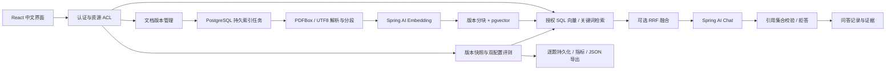

# 架构与工程取舍

CiteBase 是 Java 21 模块化单体，React 负责界面，Spring MVC 接口与后台索引worker共进程。JDBC明确执行所有权条件；Flyway控制迁移。Spring AI提供真实聊天与embedding调用。未引入微服务、消息队列、Python核心或Agent工具执行器。

## 模块与数据流

`AuthService`保存BCrypt密码与随机32字节令牌的SHA-256摘要，令牌12小时失效。每个Controller先认证，访问服务校验owner，检索SQL还在 WHERE 内限制 `knowledge_base.user_id` 和知识库ID。浏览器从不直接访问数据库或供应商密钥。

## 数据模型

`app_user → knowledge_base → document → document_version → chunk`；`index_task`绑定文档版本。`auth_session`绑定用户。`question_history`、`evaluation_run`同时绑定用户和知识库。文档删除依靠级联删除索引/任务/版本；对历史快照采取保守策略，清除整个所属知识库历史及评测，防止旧内容继续暴露。具体DDL见backend Flyway迁移。

知识库上传通过行锁序列化去重。原文件以bytea保存；版本记录SHA-256及解析类型。按空行分段，页码/页内段落从1起，偏移为规范化换行后的页内Java字符偏移，左闭右开。长段落900字符窗口、700字符步长；未变内容+相同embedding模型复用向量。旧可用版本始终保留，全部新分块完成后才在短事务内原子切换 `active_version_id`。

任务领取使用 `FOR UPDATE SKIP LOCKED`，最多3次总尝试，固定3秒重试延时；启动恢复PROCESSING。第三次中断转FAILED；显式手动重试只允许最新失败版本。MVP为单后端实例，不可直接运行多个进程共享同库worker，因为启动恢复尚无跨实例租约协议。

## 检索与生成

精确pgvector余弦检索，不用ANN索引，维度由模型返回，适合小规模可解释实验。每条候选必须来自当前可用版本、请求用户的知识库且embedding模型一致。

关键词采用Latin词和中文相邻双字bigram，PostgreSQL simple tsvector+OR查询；混合将向量候选与关键词候选等权RRF融合，`sum(1/(60+rank))`，rank从1开始，各路候选max(20,4K)，最终TopK，K范围1–20。它不生成多查询，不是教程的多查询RAG Fusion。中文同义词、词边界和跨字匹配存在局限；不宣称完整中文语义分词。

文档以JSON证据放入user消息，安全规则放system消息；不提供工具、URL抓取或数据库调用能力。模型只能看到已授权证据。回答引用UUID必须在本次检索集合，未知/缺失/残缺引用拒绝；证据不足统一返回固定拒答。引用格式校验不是事实蕴含验证，提示注入防护也不是对任意模型的形式化保证，真实行为需安全用例实测。

## 一致性与评测

问答、评测使用知识库级 PostgreSQL advisory共享读锁，版本切换和删除使用独占写锁，避免进行中问答在删除后重新保存内容，同时允许问答与评测并发。评测主事务持锁获得稳定数据版本；运行状态与每题结果用REQUIRES_NEW短事务持久化。中断后保留已完成结果并标记FAILED，用户重新建评测；索引任务则自动恢复。代价是同知识库的写入/删除会等待评测，适合单人/小团队MVP。并发数据库测试验证了读读不阻塞、删除确实在pg_locks等待。

评测保留数据版本哈希、完整题集、模型标识、脱敏endpoint、分块和检索参数。问答计时使用单调时钟；无供应商usage时存null。没有把mock哈希向量、摘录回答或API故障伪装成真实模型效果。

## 局限

不含OCR、注册/密码管理、生产速率限制、SSO、多实例调度、异步流式答案、通用人工标注工作流。同步评测请求可长时间占用连接，Nginx超时30分钟；模型超时有上限。保留历史版本会占数据库空间，当前没有自动归档策略。训练/索引/运行均不需要外部Python服务。
